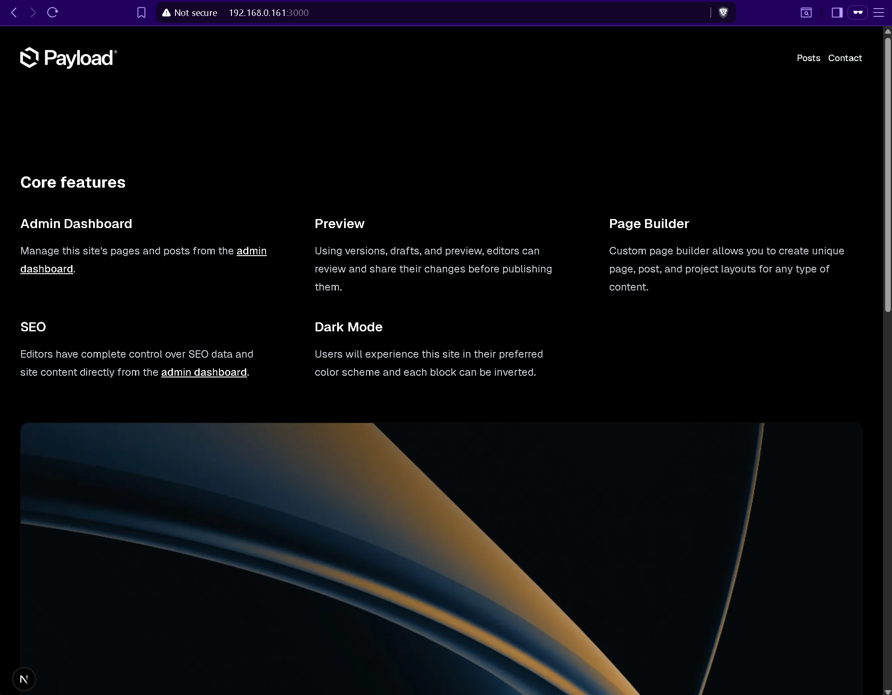
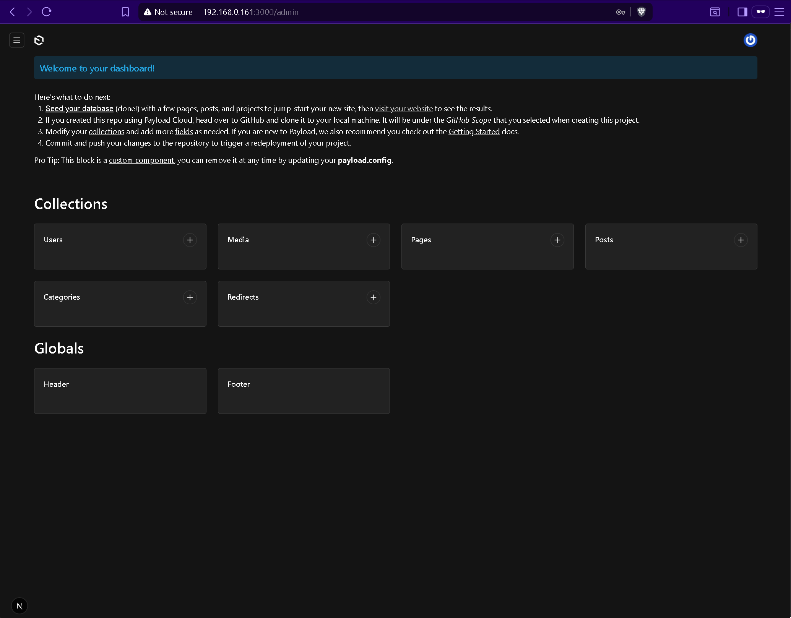
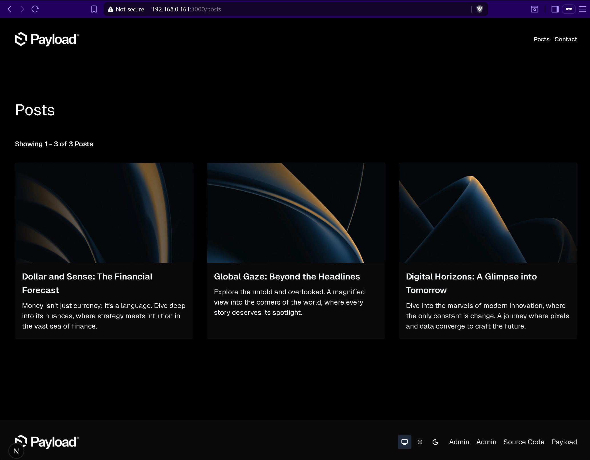

# PayloadCMS Docker Setup

A complete Docker Compose setup for [PayloadCMS](https://github.com/payloadcms/payload) with MongoDB database, featuring automatic project initialization using the enhanced [simple-payload-starter](https://github.com/gioruu/simple-payload-starter) template.

**🔧 Enhanced with Automatic Fixes**: Includes automatic patches for template issues including homepage content blocks and admin interface usability improvements.

## 🚀 Quick Start

```bash
git clone https://github.com/cskujawa/payloadcms.git
cd payloadcms
./scripts/setup.sh
```

The setup script will:
- Automatically detect your host IP address
- Generate secure environment variables
- Build and start all services
- Configure the application for external access

## ✅ Testing Status

**Fully Tested & Working** ✓

This project was tested end-to-end including:
- ✅ Full cleanup and fresh setup process
- ✅ Admin user creation and authentication
- ✅ Database seeding with sample content
- ✅ Homepage rendering with proper content blocks
- ✅ Blog posts page with images and content

All functionality works as expected out of the box.


*Modern, responsive homepage with feature blocks and elegant design*

## 📋 First-Time Setup Walkthrough

### 1. Initial Setup
```bash
# Clone the repository
git clone https://github.com/cskujawa/payloadcms.git
cd payloadcms

# Run the automated setup
./scripts/setup.sh
```

### 2. Access Your Application
The setup script will display the correct URLs for your environment:
- **Local access**: `http://localhost:3000`
- **Network access**: `http://YOUR_SERVER_IP:3000` (e.g., `http://192.168.0.161:3000`)

### 3. Create Your First Admin User
1. Navigate to the admin interface: `http://YOUR_SERVER_IP:3000/admin`
2. Click "Create your first user"
3. Fill in your admin credentials:
   - **Email**: Your admin email address
   - **Password**: Secure password (min 8 characters)
   - **First Name** & **Last Name**: Your details


*Clean, modern admin interface with all content management tools*

### 4. Seed Sample Content
1. After logging in, you'll see a "Welcome to your dashboard" banner
2. Click the **"Seed your database"** link
3. Wait for the seeding process to complete (30-60 seconds)
4. Visit your homepage to see the sample content

**What gets seeded:**
- Homepage with hero section and feature blocks
- 3 sample blog posts with images
- Media files and optimized image sizes
- Navigation and footer content


*Sample blog posts with images and rich content after seeding*

## ✨ Features

### Enhanced Template
- **Modern Stack**: TypeScript, Next.js 15, Tailwind CSS
- **UI Components**: shadcn/ui component library
- **Block-Based Building**: Flexible page content blocks
- **SEO Optimized**: Built-in meta tags and OpenGraph
- **Dark Mode**: Automatic theme switching support

### Development Experience
- **Automatic Setup**: Zero manual configuration required
- **Smart IP Detection**: Works locally and on remote servers
- **Live Reloading**: Real-time development with volume mounts
- **Reverse Proxy Ready**: nginx-proxy-manager compatible
- **Zero Host Dependencies**: Everything runs in Docker containers

### Infrastructure
- **MongoDB Integration**: Optimized database with internal networking
- **Image Processing**: Sharp integration for media optimization
- **Container Security**: Non-root user execution
- **Environment Isolation**: Secure configuration management

## 🔧 Automatic Fixes Applied

This setup includes automatic fixes for known issues in the PayloadCMS template, applied during every fresh setup:

### **Homepage Seed Fix**
**Problem**: The original `home.ts` seed data creates a homepage with broken block structure (`"blocks":[]`)
**Solution**: `seedData/home-fixed.ts` with properly structured content blocks
**Applied**: Automatically during project initialization
**Result**: Homepage displays rich content with hero sections and feature blocks instead of empty page

### **Auto-Save Interval Fix**
**Problem**: Collections have aggressive 100ms auto-save causing typing interference
- Title fields become unusable due to constant save/restore conflicts
- Characters get overwritten mid-typing
- Prevents normal text editing workflow

**Solution**: Collection fixes with 2000ms intervals for better UX
- `collectionFixes/Posts-index-fixed.ts` - Posts collection with 2s auto-save
- `collectionFixes/Pages-index-fixed.ts` - Pages collection with 2s auto-save

**Applied**: Automatically replaces original files during setup
**Result**: Smooth title editing while maintaining live preview functionality

### **Persistence Mechanism**
All fixes are preserved across cleanup cycles:
- Stored in Docker-persistent directories (`data/payloadcms/`)
- Backup/restore logic in `scripts/manage.sh` cleanup process
- Automatic application in `docker-entrypoint.dev.sh` during setup
- No manual intervention required

**Files Involved:**
```
data/payloadcms/
├── seedData/home-fixed.ts                    # Homepage content fix
├── collectionFixes/
│   ├── Posts-index-fixed.ts                 # Posts auto-save fix
│   └── Pages-index-fixed.ts                 # Pages auto-save fix
└── docker-entrypoint.dev.sh                 # Applies all fixes
```

##  Project Structure

```
payloadcms/
├── docker-compose.yaml           # Main orchestration
├── .env.example                 # Environment template
├── scripts/                     # Management scripts
│   ├── setup.sh                # Full setup and port checking
│   └── manage.sh               # Cleanup and management
└── data/
    └── payloadcms/
        ├── Dockerfile.dev              # Custom development Dockerfile
        └── docker-entrypoint.dev.sh   # Initialization script
```

##  Management Commands

```bash
# Full setup (recommended)
./scripts/setup.sh

# Complete cleanup
./scripts/manage.sh cleanup

# Manual Docker commands
docker compose up -d          # Start services
docker compose down           # Stop services
docker compose logs -f        # View logs
```

## ⚙️ Network Configuration

The system automatically configures network access based on your environment:

### Environment Variables (`.env`)
```bash
# PayloadCMS Configuration
PAYLOAD_SECRET="auto-generated-secure-key"
DATABASE_URI="mongodb://payloadcms-db/payloadcms"
NEXT_PUBLIC_SERVER_URL="http://192.168.0.161:3000"  # Auto-detected
PAYLOADCMS_HOST_PORT=3000
```

### Configuration Scenarios

#### Local Development (Single Machine)
```bash
NEXT_PUBLIC_SERVER_URL="http://localhost:3000"
```

#### Remote Server Access (Network Access)
```bash
NEXT_PUBLIC_SERVER_URL="http://192.168.0.161:3000"  # Your server's IP
```

#### Reverse Proxy Setup (nginx-proxy-manager)
```bash
NEXT_PUBLIC_SERVER_URL="http://payloadcms.yourdomain.com"
```

The setup script automatically detects your server's IP address and configures the application accordingly.

## 🔧 Troubleshooting

### Common Issues

#### Setup and Configuration

#### Port Conflicts
```bash
# Check what's using the port
sudo netstat -tulpn | grep :3000

# Or modify the port in .env
PAYLOADCMS_HOST_PORT=3001
```

#### Container IP vs Host IP Issues
The system should auto-detect the correct IP. If you see localhost instead of your server IP:
```bash
# Manually set the server URL in .env
NEXT_PUBLIC_SERVER_URL="http://YOUR_SERVER_IP:3000"

# Then restart
./scripts/manage.sh cleanup --yes
./scripts/setup.sh
```

#### Image Loading Issues
If images don't load on the posts page, check the container logs for Next.js image domain errors. The system should automatically configure image domains.

**Note**: Recent testing confirms that the seeding process works correctly and the homepage displays proper content blocks as shown in the screenshots above.

### Health Checks
```bash
# Check service status
docker compose ps

# View application logs
docker compose logs -f payloadcms-app

# Check database connectivity
docker compose exec payloadcms-db mongosh --eval "db.adminCommand('ping')"

# Verify API access
curl -f http://YOUR_SERVER_IP:3000/api/pages
```

## 🌐 Reverse Proxy Setup (nginx-proxy-manager)

### 1. Update Environment
```bash
# Edit .env file
NEXT_PUBLIC_SERVER_URL="http://payloadcms.yourdomain.com"
```

### 2. Docker Compose Network
Add your proxy network to `docker-compose.yaml`:
```yaml
networks:
  your-proxy-network:
    external: true
```

### 3. Container Configuration
Add the network to the payloadcms-app service and configure nginx-proxy-manager to route to container name `payloadcms-app:3000`.

## ⚠️ Known Warnings & Resolutions

### Expected Docker Environment Warnings
These warnings are normal in Docker environments and **do not affect functionality**:

- **Slow filesystem detection**: Expected with Docker volume mounts
- **Response aborted errors**: Normal Next.js behavior during development
- **Container IP detection**: The setup script handles this automatically

### Resolved Issues (After Updates)
✅ **Security vulnerabilities**: Updated dependencies to resolve moderate esbuild vulnerability
✅ **Deprecated packages**: Updated to latest stable versions
✅ **Browserslist data**: Updated to latest browser compatibility data

### Remaining Peer Dependency Warnings
These warnings appear due to React 19 being newer than some packages expect, but **functionality is not affected**:
```
lucide-react: expects React ^16-18, found 19.1.1
react-hook-form: expects React ^16-18, found 19.1.1
```

**Resolution**: These packages work correctly with React 19 despite the warnings. Updates will resolve this as packages catch up to React 19 support.

## 🔧 Technical Details

- **Template**: [gioruu/simple-payload-starter](https://github.com/gioruu/simple-payload-starter)
- **PayloadCMS v3**: Latest version with Next.js 15 integration
- **MongoDB**: Latest version with WiredTiger storage engine
- **Node.js 18**: Alpine Linux containers for efficiency
- **Smart Initialization**: Git clone + automatic configuration
- **Image Processing**: Sharp with Alpine Linux compilation
- **Development Optimized**: Volume mounts for live development

## 📝 License

MIT License - feel free to use and modify as needed.

## 🤝 Contributing

This project enhances the original PayloadCMS template with automatic fixes and optimizations. Contributions are welcome, especially:

- Additional template fixes and improvements
- Enhanced Docker configuration
- Documentation improvements
- Performance optimizations

## 🙏 Acknowledgments

- [PayloadCMS](https://github.com/payloadcms/payload) - The amazing headless CMS
- [gioruu/simple-payload-starter](https://github.com/gioruu/simple-payload-starter) - Enhanced template foundation
- Docker community for containerization best practices
